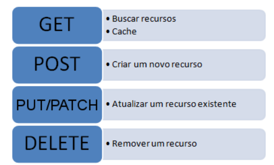
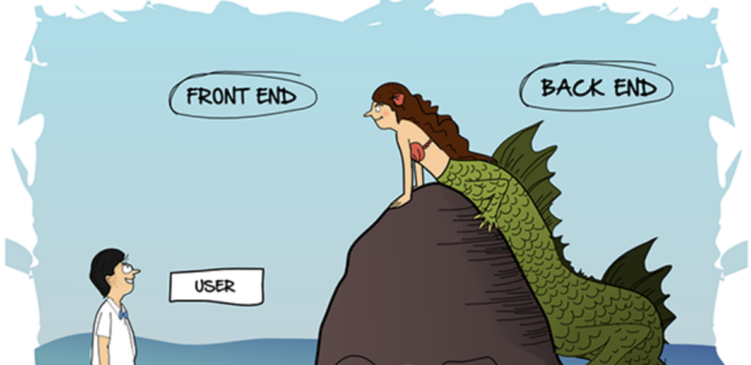
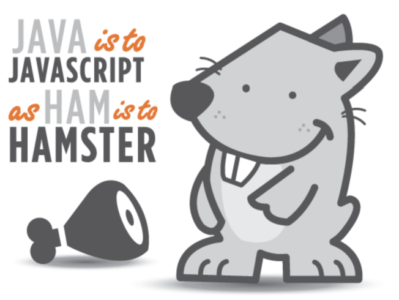

# Desenvolvimento Web com Django Framework

Python é uma linguagem promissora para diversos fins com destaque para

- IA
- Computação Quântica

O Django é um framework poderoso e completo que utiliza python para aplicações web.

<!-- 

## Base de programação web

 
-->

## Base de programação web

> Anotações gerais sobre programação web

**Protocolos http e seus verbos**

- É um dos protocolos mais importantes e utilizados no mundo.
- a porta padrão sem critografia é a 80 (http)
- a por com criptografia é a 443 (https)
- [documentação oficial](1]https://tools.ietf.org/html/rfc7540)

**Linguagens Estáticas X Dinâmicas**

- Linguagens estáticas: não são processadas no servidor, renderizada no navegador.
- Linguagens dinâmicas: são processadas no servidor

**HTML, CSS e JS**

- HTML é um arquivo de texto com marcações (texto com vitaminas). Somente com o html já temos uma página web. Mas é um site pelado.
- CSS é a estética de um arquivo html. Veste o html à rigor, deixando a página apresentável. Com o css podemos tramalhar com:
  - `elemento`
  - `.` classe
  - `#` id
- JavaScript (nome de batismo => Ecma Script) completa a tríade do frontend. Serve para interatividade com o usuário
  - usar os scripts js no final do arquivo, evita inconvenientes, pois teremos todos os elementos já carregados antes de quaisquer interações.

**Frameworks Frontend**

- [Bootsrap](https://getbootstrap.com.br)
- Bulma

## Django Básico

 

