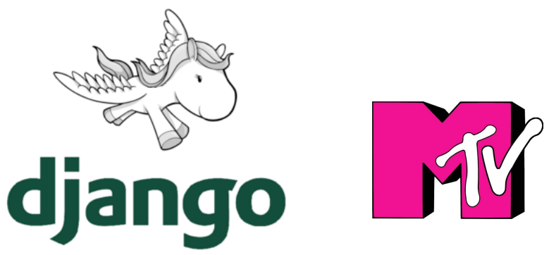
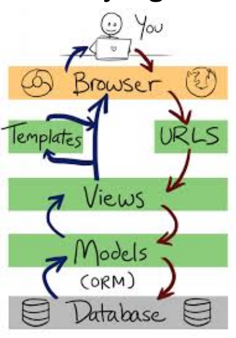

# Desenvolvimento Web com Django Framework

Python é uma linguagem promissora para diversos fins com destaque para

- IA
- Computação Quântica

O Django é um framework poderoso e completo que utiliza python para aplicações web.

<!-- 
<details>
<summary>

## Base de programação web
</summary>

</details> 
-->

<details>
<summary>

## Base de programação web
</summary>
> Anotações gerais sobre programação web


**Protocolos http e seus verbos**

- É um dos protocolos mais importantes e utilizados no mundo.
- a porta padrão sem critografia é a 80 (http)
- a por com criptografia é a 443 (https)
- [documentação oficial](1]https://tools.ietf.org/html/rfc7540)


**Linguagens Estáticas X Dinâmicas**

- Linguagens estáticas: não são processadas no servidor, renderizada no navegador.
- Linguagens dinâmicas: são processadas no servidor


**HTML, CSS e JS**

- HTML é um arquivo de texto com marcações (texto com vitaminas). Somente com o html já temos uma página web. Mas é um site pelado.
- CSS é a estética de um arquivo html. Veste o html à rigor, deixando a página apresentável. Com o css podemos tramalhar com:
  - `elemento`
  - `.` classe
  - `#` id
- JavaScript (nome de batismo => Ecma Script) completa a tríade do frontend. Serve para interatividade com o usuário
  - usar os scripts js no final do arquivo, evita inconvenientes, pois teremos todos os elementos já carregados antes de quaisquer interações.


**Frameworks Frontend**

- [Bootsrap](https://getbootstrap.com.br)
- Bulma

</details>


<details>
<summary>

## Django Básico
</summary>

### Instalação

- Usar `virtual env`
- `pip install django`
- `pip freeze > requiriments.txt`
- rodar virtual env `.venv/Scripts/Activate.ps1`
- 
### Criar projeto

- `django-admin startproject nomeProjeto .` O "." ao final da instrução é para que o projeto seja criado no diretório atual, e não em um subdiretório
- `django-admin startapp NomeDoApp`
- inserir o nome do app criado dentro do `settings.py` do projeto, na lista de `INSTALLED_APPS `.
- adicionar o diretório de templates dentro da variável `TEMPLATES` no settings.py

### Rodar Projeto

- `python manage.py runserver`

### MTV Deseign Pattern



- quem tem as views são as aplicações, e não o projeto
- as views são funções python
  ```
  def index(request):
    return render(request, "index.html")

  def contato(request):
    return render(request, "contato.html")
  ```
- por padrão as `urls` são do projeto, e não na aplicação.



### Migrations

- `python .\manage.py makemigrations`
- `python .\manage.py migrate`

### Area admin

- `python .\manage.py createsuperuser`

### Models

É um modelo de dados


```python
# retorna no console todos os dados da requisição
dict_request_data = request.headers
  for k, v in dict_request_data.items():
    print(f"{k}: {v}")
```

### Django shell

dir(nomeObjeto) -> mostra todos os métodos que podemos usar no objeto


Inserir arquivos estáticos
- `` no cabeçalho do html
- `<link rel="stylesheet" href="">` como referência

**No arquivo `settings.py`**

```python
# usado durante o desenvolvimento
STATIC_URL = "static/"
# usado para produção
STATIC_ROOT = Path(BASE_DIR, "static_files")
```

</details> 

